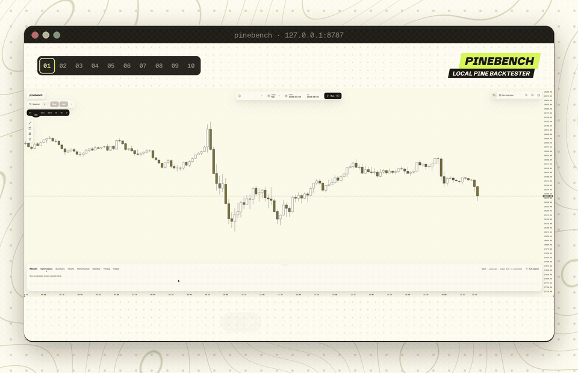
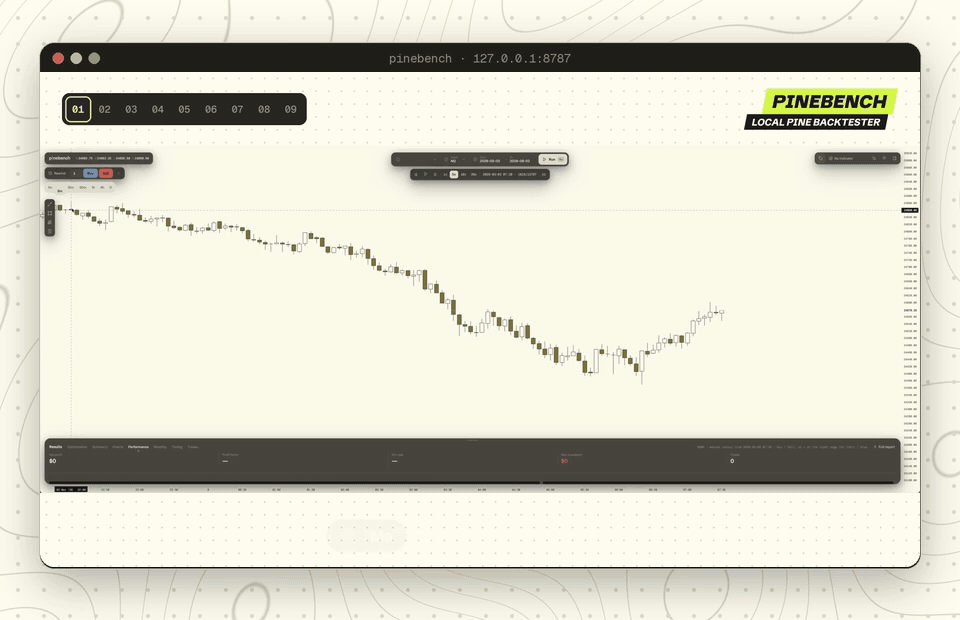
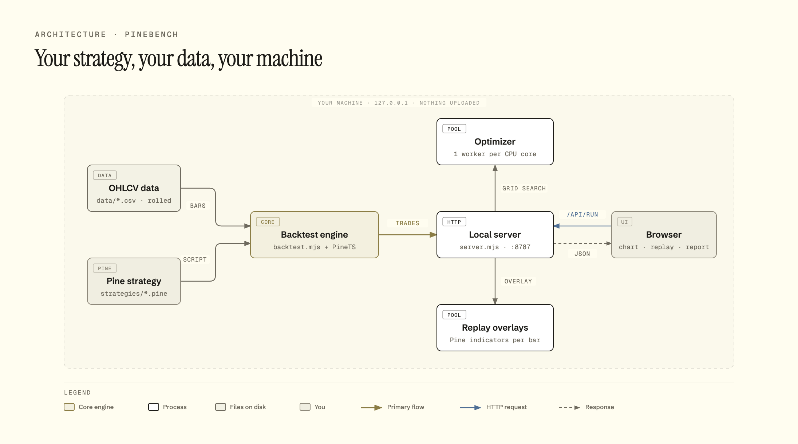

<p align="center"></p>

# Pinebench

Run TradingView **Pine Script strategies locally** on your own OHLCV data. Multi-year 1m backtests, a TradingView-style report, bar-by-bar replay with indicator overlays, and a parallel input optimizer. No TradingView history limits, no upload of your strategy anywhere.

Built on [PineTS](https://github.com/LuxAlgo/PineTS) (the Pine Script runtime) and [lightweight-charts](https://github.com/tradingview/lightweight-charts).

## Backtest a strategy

Pick a Pine strategy and hit Run. Replay it bar by bar while it places its own entries, stops and targets, then open the full report, or skip to the end for the whole date range.

<p align="center"></p>

## Trade the replay yourself

Practice on history like it's live. Buy or sell at the current bar, drag SL and TP straight on the chart, and see each trade's P&L as the bars play forward.

<p align="center"></p>

## How it works

Everything runs on your machine. Your CSV bars and Pine script go into the PineTS engine, a local server hands the results to the browser, and worker pools handle optimization and replay overlays.

<p align="center"></p>

## Features

- **Your Pine, unchanged.** Drop a `.pine` / `.txt` strategy into `strategies/`, and it shows up in the UI. Script inputs become form fields.
- **Your data.** Any CSV with a time column and `open,high,low,close` (`volume`, `symbol` optional). Databento OHLCV exports work as-is.
- **Futures-aware.** Multi-contract files are rolled to the front month per day (highest volume); calendar spreads are dropped. Tick size and point value presets for NQ/MNQ, ES/MES, CL, GC, YM, RTY.
- **Report.** Net profit, drawdown, profit factor, Sharpe/Sortino, equity/drawdown chart, P&L distribution, Long/Short split, monthly heatmap, full trade list. Click a trade to jump to it on the chart.
- **Replay.** Step through bars with any Pine *indicator* overlaid as it looked at that moment, with open-trade TP/SL lines.
- **Manual trading.** Buy or sell on the replay, drag SL/TP on the chart, flip or close at market.
- **Optimizer.** Start/step/stop ranges per input, grid search across all CPU cores, with live progress and a sortable results table.

## Quick start

Requires Node 20+.

```bash
git clone <this repo> && cd pinebench
npm install
# put CSVs in ./data, strategies in ./strategies
npm start              # → http://127.0.0.1:8787
```

A sample strategy (`strategies/example-sma-cross.pine`) and one month of BTCUSDT 1m bars (`data/sample/`, from [Binance public data](https://data.binance.vision)) are included, so you can run a backtest right away. Add your own CSVs to `data/` for anything else.

- Port: `node server.mjs 9000`
- Data/indicators somewhere else: `BT_ROOT=/path/to/folder npm start` (scanned two levels deep for `.csv` files and Pine `indicator()` scripts).
- Self-check: `npm test`

## Data

Any CSV with a time column and OHLC (column order doesn't matter):

```
ts_event,open,high,low,close,volume,symbol
2026-10-07T13:30:00Z,25001.25,25010.00,24998.50,25007.75,812,MNQZ6
```

## License

[AGPL-3.0-only](LICENSE), the same as PineTS. If you run a modified version as a network service, you must offer its source to its users.

Not financial advice. Backtests are not live results.
